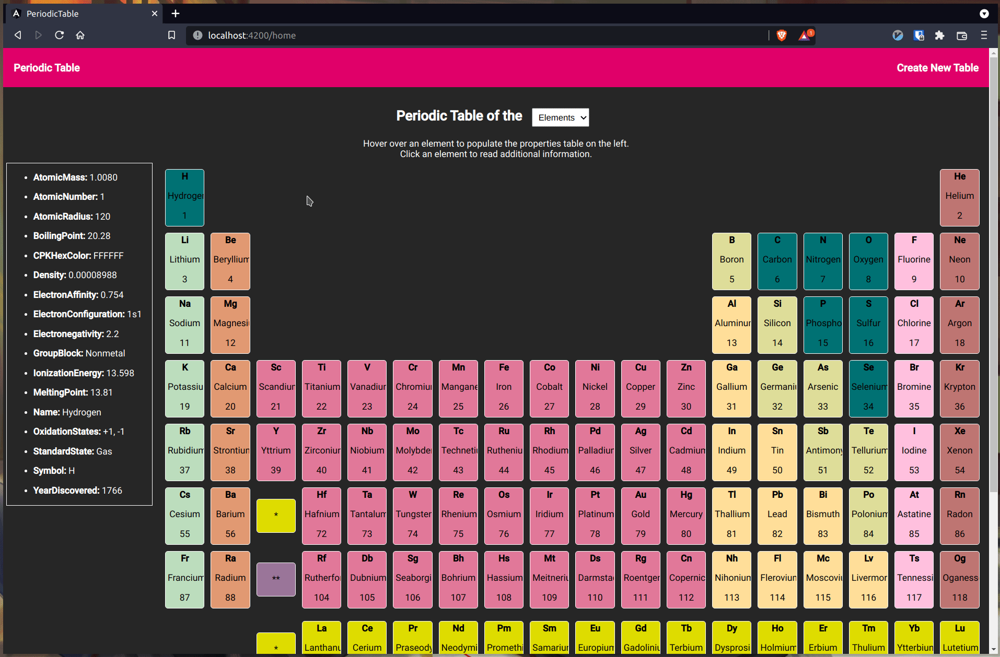

This project is for a software engineering course that I am currently taking
and is under active development.

<iframe id="kaltura_player" src="https://cdnapisec.kaltura.com/p/391241/sp/39124100/embedIframeJs/uiconf_id/22119142/partner_id/391241?iframeembed=true&playerId=kaltura_player&entry_id=1_4xe8iuup&flashvars[localizationCode]=en&amp;flashvars[leadWithHTML5]=true&amp;flashvars[sideBarContainer.plugin]=true&amp;flashvars[sideBarContainer.position]=left&amp;flashvars[sideBarContainer.clickToClose]=true&amp;flashvars[chapters.plugin]=true&amp;flashvars[chapters.layout]=vertical&amp;flashvars[chapters.thumbnailRotator]=false&amp;flashvars[streamSelector.plugin]=true&amp;flashvars[EmbedPlayer.SpinnerTarget]=videoHolder&amp;flashvars[dualScreen.plugin]=true&amp;flashvars[hotspots.plugin]=1&amp;flashvars[Kaltura.addCrossoriginToIframe]=true&amp;&wid=1_ez7xd1k5" width="480" height="304" allowfullscreen webkitallowfullscreen mozAllowFullScreen allow="autoplay *; fullscreen *; encrypted-media *" sandbox="allow-forms allow-same-origin allow-scripts allow-top-navigation allow-pointer-lock allow-popups allow-modals allow-orientation-lock allow-popups-to-escape-sandbox allow-presentation allow-top-navigation-by-user-activation" frameborder="0" title="Kaltura Player"></iframe>

[https://media.oregonstate.edu/media/t/1_4xe8iuup](https://media.oregonstate.edu/media/t/1_4xe8iuup)

[https://media.oregonstate.edu/id/1_4xe8iuup?width=400&height=285&playerId=22119142](https://media.oregonstate.edu/id/1_4xe8iuup?width=400&height=285&playerId=22119142)

<!--  -->
